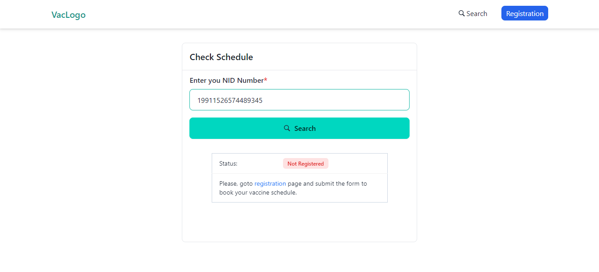

# Vaccine System

This is a vaccine system. People can request for vaccine schedule by submitting registration form. People can search his schedule in search page by providing his NID number. Notification will be sent to the person before the night of taking vaccination.

Author: **Kaiser Hamid**  
Date: **2024-10-12**

## Requirements:

- Server config same as laravel 11
- Node version 18 or above

## Instructions:

- There are two seperate projects. One is backend (Laravel API), another is frontend (Reactjs)
- Clone the project **git clone https://github.com/kaiser-hamid/vaccine_registration.git**

  ## Instructions for backend:

  - Go to backend project and run **composer install**
  - Set .env values (QUEUE_CONNECTION, MAIL_MAILER, DB_CONNECTION along with its related configs, APP_TIMEZONE=Asia/Dhaka to send email at bd time)
  - Run **php artisan migrate** and **php artisan db:seed**
  - Run **php artisan serve**
  - Keep running **php artisan queue:work** and **php artisan schedule:work**

  For optimizing performance, I've followed some rules like, eager loading, indexing db columns, reduce the number of query in complex part like vaccinee distribution.
  We could improve more if we could implement redis or any third party cache server to reduce db query.

  ### Additional note:

  There is requirement that another notification system could be integrated in future.
  To obtain this, I've implemented composite design pattern.
  So, in future, we can just create a Service Class by implementing **App\Contracts\NotificationContract** contract (where we will handle all SMS sending logic) and assign this service class in **AppServiceProvider** NotificationContract binding as a second value in the UserNotificationService initialization.

  ## Instructions for frontend:

  - Go to backend project and run **npm install** from the project command line
  - Adjust your endpoint URL from `/src/config/data.js`
  - Run `npm start`
  - Open your browser and navigate to `http://localhost:5173` or the port your project running on

# Screenshots

